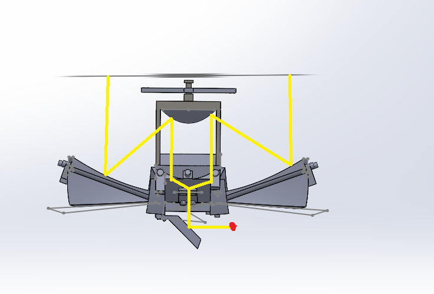
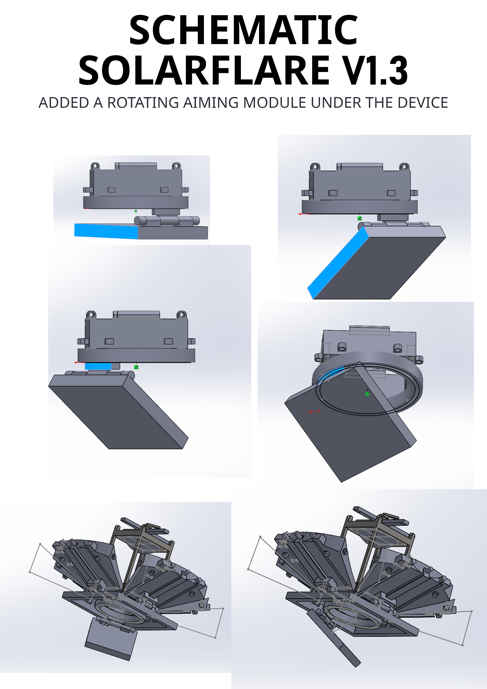
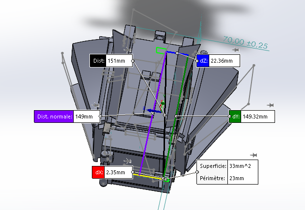

# 🔆 Solar Flare V1 – Open Hardware Prototype

  

Solar Flare is an experimental prototype of a **foldable solar concentrator**, designed to demonstrate the possibility of turning a small, portable surface into a powerful solar focal point.  
This project is released as **open hardware** (under a dual license, see below) to share the idea, gather feedback, and explore wider applications.

---

## ⚙️ How it works

The system is based on:  
- A central **Fresnel lens** that concentrates sunlight.  
- Foldable **parabolic side mirrors**, which increase the collecting surface and redirect light to the lens.  
- A **primary focal point** located below the lens, where the solar energy is strongly concentrated.

👉 Special feature:  
An **optional secondary deflector mirror** can be added at the bottom of the device.  
- Without the mirror: the focal point is vertical, directly under the lens (maximum efficiency).  
- With the mirror: the beam is redirected horizontally, which effectively doubles the final focal length. This makes it easier to light a cigarette or ignite material while holding the device sideways, **without risking damage to the lens or burning the structure** due to the short focal length (~3 cm).  
This mirror acts as an **ergonomic module**, optional but practical for portable use.

---

## 📐 Current dimensions (V1)

- **Open**: ~282 mm × 282 mm × 184 mm (mirrors deployed).  
- **Closed**: ~170 mm × 170 mm × 150 mm (mirrors folded).  
- **Effective collecting area**: about 321 cm², equivalent to 32.1 W theoretical, ~18 W after losses (mirror, lens, alignment).

---

## 🛠️ Improvement goals

- **Portability**: optimize folding to reduce packed size.  
- **Automation**: design a synchronization system for simultaneous mirror opening/closing.  
- **Locking**: add solid blocking systems to prevent unwanted movement.  
- **Performance**:  
  - optimize geometry to reduce optical losses,  
  - explore a **miniature version** (portable fire starter),  
  - and a **large-scale version** (solar heating, cooking, industrial applications).  

---

## 💡 Potential applications

- 🔥 **Portable fire starter** (campfire, barbecue, cigarette).  
- 🌞 **Educational demonstration module** for solar energy.  
- 🔋 **Possible extensions**:  
  - detachable photovoltaic cell for USB charging,  
  - small Stirling engine to produce motion or ventilation,  
  - large-scale version for home heating, camper vans, or light industry.  
[futur](docs/futur)

---

## 🔗 Used in other open-hardware projects

Solar Flare is also used as a **core solar heat module** in other open-hardware concepts:

- **[SolarLift](https://github.com/f-buisson/SolarLift)** – thermal-lift-based **gravity energy storage** (heat → mechanical lift → potential energy).  
- **[SolarWell](https://github.com/f-buisson/SolarWell)** – **low-tech solar distillation** unit to turn seawater or polluted water into drinkable water using only the sun.

These projects reuse Solar Flare as a **shared concentrator**, and explore how the same solar hardware can:
- lift weights slowly (SolarLift),
- produce small amounts of clean water (SolarWell).

---

## 🌞 Sun-tracking concepts (doc)

Solar Flare can be used with or without tracking.  
Several **low-tech ideas** to keep the concentrator roughly aligned with the sun (thermal tracking with bimetal strips, gravity-driven “clock” systems, hybrid micro-powered tracking, and integration with SolarLift / SolarWell) are described in:

- **[Sun tracking concepts](docs/Sun_Tracking_concepts.md)**

---

## 📂 Provided resources

- 3D SolidWorks plans (screenshots and flat drawings).
  [Solar open](images/Solar_Open.PNG)
  [Solar divers](images/vue_divers.PNG)
 
- PDF files showing the **open** and **closed** versions.
  [Assemblage V1 – fermé](images/Assemblage_V1_fermé.PNG)
  [Assemblage V1 – ouvert](images/Assemblage_V1_ouvert.PNG)
  
---

## 🧪 Prototyping approach (planned)

To avoid jumping directly into miniaturization, the next physical build will be a **scale ×2 Proof of Concept** (relative to the current V1 CAD).
The goal is to obtain a **more robust, less portable but more performant** first unit and to validate the global geometry and mechanical behavior more easily.

This ×2 scale also helps reduce early issues linked to a **very short focal distance** in the ×1 format, making alignment and testing safer and more repeatable.

Planned steps:
- **POC ×2**: validate optics, folding logic, mechanical reliability, and thermal constraints.
- **DFM pass**: simplify parts and improve tolerances for easier assembly.
- **Portable scale ×1**: re-miniaturize with validated geometry.
- **Micro-series (~10 units)**: optimize cost and assembly for limited production.

---

## 🔐 License & Usage

This project is **open-hardware**: you are free to learn from it, modify it, repair it, and reproduce it.

- **Personal / educational / non-commercial use** → OK ✅  
  (CERN-OHL-S 2.0 + CC BY-NC-SA 4.0)

- **Professional / commercial use** → requires a **dedicated licence**  
  (to support ongoing development, cover R&D costs, and prevent misuse)  
  👉 https://scgfamp.lemonsqueezy.com/buy/8430de49-9b31-4802-a4e6-0b24f7f69aad

> **Note:** Commercial-use permission is **automatically granted** while an active  
GitHub Sponsorship at the **$350/month tier (or higher)** is maintained.  
If the sponsorship is downgraded or cancelled, the permission **immediately ends**.  
No retroactive or continuing rights are provided after cancellation.

---

## Project evolution

  * [Version 1.1] – Added a functional solar sight + first cable system (to be optimized).
  * [Version 1.2] – Added a synchronized mirror actuation system using cable routing + alignment rails.
    * All mirrors open/close together
    * Improved global alignment
    * Trade-off: slightly larger mechanism + requires precise cable tensioning
  * **Version 1.3 – Added a rotating aiming module under the device**
    * New bottom block that can rotate 360° around the main axis.
    * Flat mirror mounted on a hinge, tilting from 0° to ~90°.
    * Allows aiming the concentrated spot **anywhere below the device** (from slightly downward to near-horizontal).
    * If the mirror is tilted out of the beam, the spot simply appears vertically under Solar Flare.
    * V1.3 does not change the optical design; it only adds an ergonomic “steering” layer.

---

## 📣 Contribution & feedback

This project is still at the **experimental prototype stage**.  
Any constructive criticism, suggestions for mechanical or optical improvements are welcome.  
You can open an **issue** or submit a **pull request**.

---

### 🫶 Support this project

I release these projects as **open-hardware**, so anyone can study, adapt, and rebuild them freely.  
If you'd like to help the development continue and support new prototypes:  
👉 https://github.com/sponsors/f-buisson  
Even a symbolic contribution helps to:
- fund necessary materials
- develop and test prototypes
- cover software licensing fees (SolidWorks, etc.)

Thank you for your support ✦

---

## ⚠️ Disclaimer

This prototype is an **experimental project**.  
It is **not designed for direct commercial use**, nor guaranteed in terms of safety.  
⚠️ Warning: the solar focal point can reach dangerous temperatures. Use only outdoors, with caution.

---

# 🔆 Solar Flare V1 – Prototype Open Hardware

  

Solar Flare est un prototype expérimental de **concentrateur solaire pliable**, conçu pour démontrer la possibilité de transformer une petite surface transportable en un foyer solaire puissant.  
Ce projet est publié en **open hardware** (sous licence mixte, voir plus bas) afin de partager l’idée, recueillir des retours, et explorer des usages plus larges.

---

## ⚙️ Fonctionnement

Le système repose sur :  
- Une **lentille de Fresnel** centrale qui concentre les rayons solaires.  
- Des **miroirs paraboliques latéraux** pliables, qui augmentent la surface collectrice et redirigent la lumière vers la lentille.  
- Un **point focal principal** situé sous la lentille, où l’énergie lumineuse se concentre fortement.

👉 Particularité :  
Un **miroir déflecteur secondaire optionnel** peut être ajouté en bas du dispositif.  
- Sans miroir : le foyer est vertical, directement sous la lentille (rendement maximal).  
- Avec miroir : le rayon est dévié horizontalement, ce qui permet de doubler la focale finale et par exemple d’allumer une cigarette ou un combustible en tenant l’objet sur le côté, **sans risquer d’endommager la lentille ni de brûler la structure** à cause de la courte distance focale (~3 cm).  
Ce miroir agit comme un **module ergonomique**, facultatif mais pratique pour un usage portatif.

---

## 📐 Dimensions actuelles (V1)

- **Ouvert** : ~282 mm x 282 x 184 mm  (miroirs déployés).  
- **Fermé** : ~170 mm x 170 x 150 mm (miroirs repliés).  
- **Zone collectrice équivalente** : environ 321 cm², soit 32,1 W théorique donc environ 18 W après les pertes (miroir, lentille, alignement).

---

## 🛠️ Objectifs d’amélioration

- **Portabilité** : optimiser le pliage pour réduire l’encombrement.  
- **Automatisation** : concevoir un système de synchro pour ouverture/fermeture simultanée des miroirs.  
- **Verrouillage** : ajouter des systèmes de blocage solides pour éviter les mouvements parasites.  
- **Performance** :  
  - optimiser la géométrie pour réduire les pertes optiques,  
  - envisager une version **miniature** (allume-feu portable),  
  - et une version **grande échelle** (chauffage solaire, cuisine, applications industrielles).  

---

## 💡 Applications envisagées

- 🔥 **Allume-feu portable** (feu de camp, barbecue, cigarette).  
- 🌞 **Module de démonstration pédagogique** sur l’énergie solaire.  
- 🔋 **Extensions possibles** :  
  - cellule photovoltaïque amovible pour recharge USB,  
  - micro-moteur Stirling pour produire du mouvement ou ventiler,  
  - version géante pour chauffage domestique, camping-car, ou petite industrie.  
[futur](docs/futur)

---

## 🔗 Utilisé dans d’autres projets open-hardware

Solar Flare est également utilisé comme **module de chaleur solaire central** dans d’autres concepts open-hardware :

- **[SolarLift](https://github.com/f-buisson/SolarLift)** – système de **stockage d’énergie gravitaire** par élévation lente de poids via la chaleur solaire.  
- **[SolarWell](https://github.com/f-buisson/SolarWell)** – unité de **distillation solaire low-tech** pour transformer de l’eau de mer ou légèrement polluée en eau potable uniquement grâce au soleil.

Ces projets réutilisent Solar Flare comme **concentrateur commun**, et explorent comment le même hardware solaire peut :
- stocker un peu d’énergie (SolarLift),  
- produire un peu d’eau potable (SolarWell).

---

## 🌞 Concepts de suivi solaire (doc)

Solar Flare peut être utilisé avec ou sans système de suivi.  
Quelques pistes **low-tech** pour garder le concentrateur à peu près aligné sur le soleil (suivi thermique par lames bimétalliques, systèmes gravitaires type horloge, suivi hybride micro-alimenté, intégration avec SolarLift / SolarWell) sont décrites ici :

- **[Concepts de suivi solaire](docs/Sun_Tracking_concepts.md)**

---

## 📂 Ressources fournies

- Plans 3D SolidWorks (captures et mises à plat).
  [Solar open](images/Solar_Open.PNG)
  [Solar divers](images/vue_divers.PNG)
  
- Fichiers PDF illustrant la version **ouverte** et **fermée**.  
  [Assemblage V1 – fermé](images/Assemblage_V1_fermé.PNG)
  [Assemblage V1 – ouvert](images/Assemblage_V1_ouvert.PNG)

  ---

## 🧪 Approche de prototypage (prévue)

Pour éviter de commencer directement par la miniaturisation, la prochaine réalisation physique sera un **Proof of Concept à l’échelle ×2** (par rapport à la CAO actuelle V1).
L’objectif est d’obtenir un premier prototype **plus robuste, moins portable mais plus performant**, afin de valider la géométrie globale et le comportement mécanique avec un confort de test supérieur.

Cette échelle ×2 permet aussi de limiter les difficultés initiales liées à une **distance focale très faible** au format ×1, rendant l’alignement et les essais plus sûrs et plus reproductibles.

Étapes envisagées :
- **POC ×2** : validation optique, logique de pliage, fiabilité mécanique et contraintes thermiques.
- **Passe DFM** : simplification des pièces et optimisation des tolérances.
- **Version portable ×1** : re-miniaturisation avec géométrie validée.
- **Micro-série (~10 unités)** : optimisation coût/assemblage pour production limitée.

---

## 🔐 Licence & Conditions d’usage

Ce projet est publié en **open-hardware** : vous êtes libre de l’**étudier**, le **modifier**, le **réparer** et le **reproduire**.

- **Usage personnel / éducatif / non-commercial** → Autorisé ✅  
  (CERN-OHL-S 2.0 + CC BY-NC-SA 4.0)

- **Usage professionnel / commercial** → nécessite une **licence dédiée**  
  (afin de soutenir le développement, couvrir les coûts R&D et éviter les abus)  
  👉 https://scgfamp.lemonsqueezy.com/buy/8430de49-9b31-4802-a4e6-0b24f7f69aad

> **Note :** Le droit d’usage commercial est **automatiquement accordé** si un
> sponsoring GitHub est actif au **palier de 350€/mois (ou supérieur)**.  
> Si le sponsoring est réduit ou annulé, l’autorisation commerciale **prend fin immédiatement**.  
> Aucun droit rétroactif ou permanent n’est conservé après l’arrêt du sponsoring.

---

## Évolution du projet

  * [Version 1.1] – Ajout d’un viseur solaire fonctionnel + premier système de câbles (à optimiser).
  * [Version 1.2] – Ajout d’un système de synchronisation des miroirs via câbles + rails de guidage.
    * Ouverture / fermeture simultanée des panneaux
    * Alignement global amélioré
    * Compromis : légère augmentation de l’encombrement + nécessité d’un réglage précis des câbles
  * **Version 1.3 – Ajout d’un module de visée rotatif sous l’appareil**
    * Nouveau bloc inférieur rotatif à 360° autour de l’axe principal.
    * Miroir plan monté sur charnière, inclinable de 0° à ~90°.
    * Permet de viser le point chaud **vers n’importe quelle direction située sous l’appareil** (du légèrement vers le bas jusqu’au quasi horizontal).
    * Quand le miroir est sorti du faisceau, le point focal apparaît simplement à la verticale, sous Solar Flare.
    * La V1.3 ne modifie pas le design optique ; elle ajoute uniquement une couche de pilotage plus ergonomique.

---

## 📣 Contribution & retours

Ce projet est encore **au stade de prototype expérimental**.  
Toute critique constructive, suggestion d’optimisation mécanique ou optique est la bienvenue.  
Vous pouvez ouvrir une **issue** ou proposer une **pull request**.

---

### 🫶 Soutenir ce projet

Je publie ces projets en **open-hardware**, pour que chacun puisse les comprendre, les adapter et les reconstruire librement.  
Si tu souhaites contribuer à leur évolution et à la création de nouveaux prototypes :  
👉 https://github.com/sponsors/f-buisson  
Chaque contribution (même symbolique) permet de :
- financer les matériaux nécessaires
- développer et tester les prototypes
- couvrir les licences logicielles (SolidWorks, etc.)

Merci pour ton soutien ✦

---

## ⚠️ Disclaimer

Ce prototype est un projet **expérimental**.  
Il n’est **pas conçu pour un usage commercial direct**, ni garanti en termes de sécurité.  
⚠️ Attention : le foyer solaire peut atteindre des températures dangereuses. Utiliser uniquement en extérieur, avec précaution.

---
