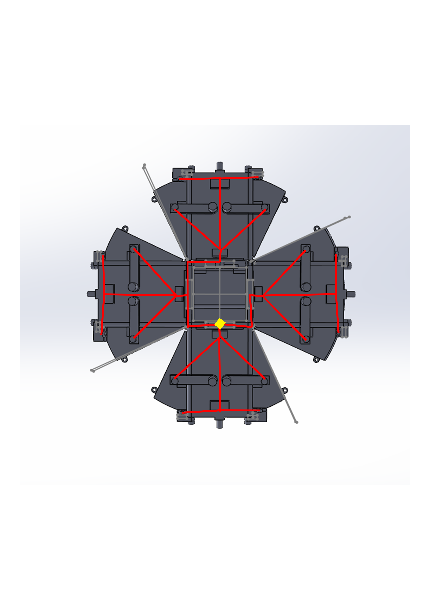
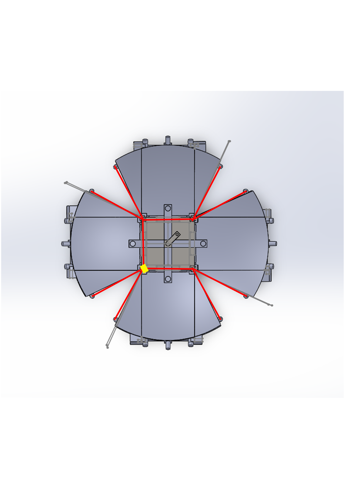
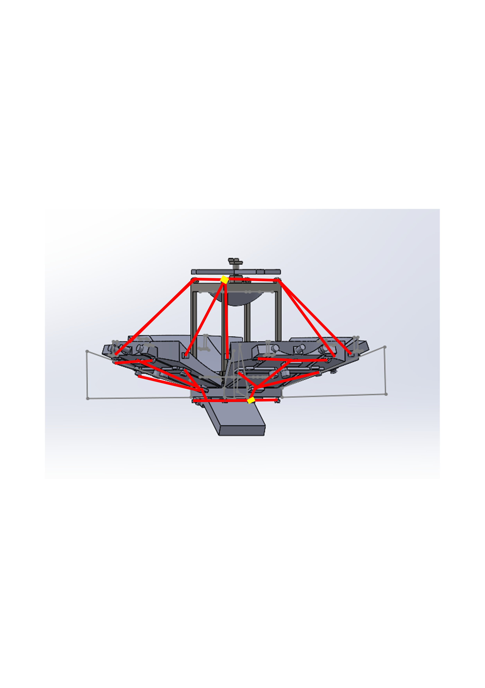

# Solar Flare – Version 1.1

This version brings two major improvements compared to V1:

1. **Addition of the solar sight**  
   - The sight allows proper alignment of the device in order to concentrate the light energy.  

2. **Integration of a cable system (under optimization)**  
   - Implementation of two distinct cable networks:  
     - **Global deployment**: simultaneously pulls on all panels to close the structure.  
     - **Side panels (underneath)**: acts on the side flaps of each mirror.  
   - The principle has been validated schematically, but still requires optimization to reduce friction and improve cable tension.

---

## Planned cabling diagrams

### Bottom view – Side panels

The cables run under the structure and actuate the side flaps of each mirror.  
Pulling on the control area (yellow) folds the flaps in a coordinated way.

---

### Top view – Global deployment
 
The upper cables connect each main panel.  
Pulling on the control area (yellow) simultaneously closes all the panels.

---

### Side view – Global overview

The side view highlights the separation between:  
- the upper network for global closing,  
- and the lower network for the side panels.  

These two independent loops allow separate control of the two functions.  
But the bottom must be closed before the top for the system to shut properly.

---

## Points to optimize (next steps)
- Test a **physical prototype** (cardboard/string model or 3D print) to validate the kinematics.  
- Find a more efficient opening/closing automation system.  

---

**Solar Flare V1.1 = functional sight + cable system validated schematically (optimization in progress).**

---

# Solar Flare – Version 1.1

Cette version apporte deux évolutions majeures par rapport à la V1 :

1. **Ajout du viseur solaire**  
   - Le viseur permet d’orienter correctement l’appareil afin de concentrer l’énergie lumineuse.  

2. **Intégration d’un système de câblage (en cours d’optimisation)**  
   - Mise en place de deux réseaux de câbles distincts :  
     - **Déploiement global** : tire simultanément sur tous les panneaux pour fermer la structure.  
     - **Parois latérales (dessous)** : agit sur les volets latéraux de chaque miroir.  
   - Le principe est validé schématiquement, mais nécessite encore des optimisations pour réduire les frottements et améliorer la tension des câbles.

---

## Schémas de câblage envisagés

### Vue dessous – Parois latérales
  
Les câbles passent sous la structure et actionnent les volets latéraux de chaque miroir.  
En tirant sur la zone de commande (jaune), les volets se replient de manière coordonnée.

---

### Vue dessus – Déploiement global
  
Les câbles supérieurs relient chaque panneau principal.  
Tirer sur la zone de commande (jaune) entraîne la fermeture simultanée de tous les panneaux.

---

### Vue de côté – Synthèse globale
  
La vue latérale met en évidence la séparation entre :  
- le réseau supérieur pour la fermeture global,  
- et le réseau inférieur pour les parois latérales.  

Ces deux boucles indépendantes permettent un contrôle distinct des deux fonctions. Mais il faut fermé le bas avant le haut pour que cela se ferme correctement.

---

## Points à optimiser (prochaines étapes)
- Tester un **proto physique** (maquette carton/ficelle ou impression 3D) pour valider la cinématique.
- Trouver une automatisation ouverture/fermeture plus efficace.   

---

**Solar Flare V1.1 = viseur fonctionnel + système de câbles validé schématiquement (optimisation en cours).**
