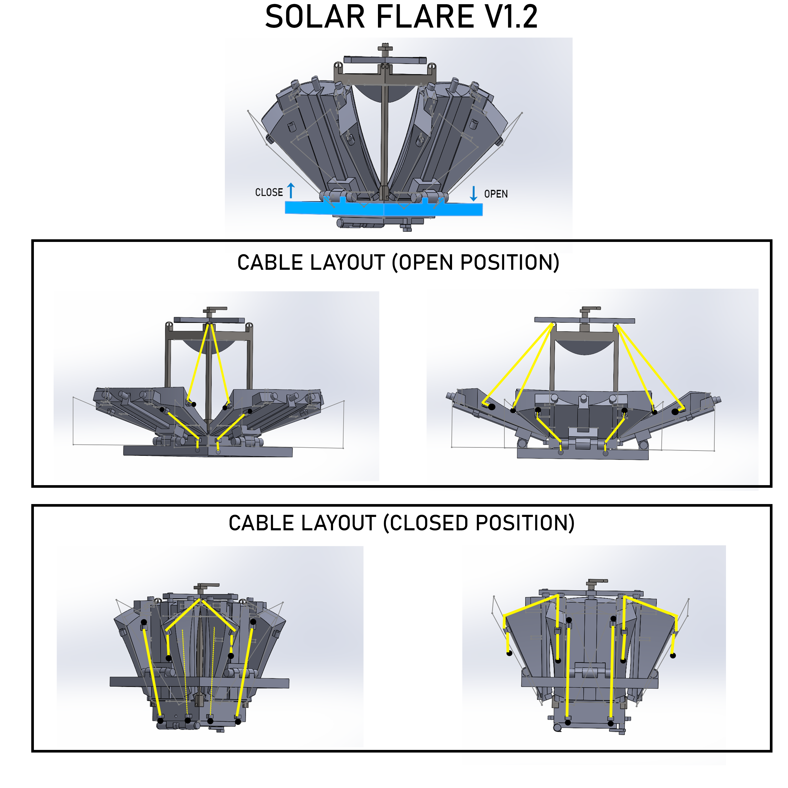

# Solar Flare V1.2 — Synchronized Mirror Closing System

> V1.2 is a mechanical iteration focused on improving the synchronized
> opening and closing of the mirror assembly while maintaining the optical geometry.

This version introduces a **synchronized folding mechanism**  
for the lateral mirrors.  
The movement is managed through **guided cables** + **alignment rails**,  
allowing **all panels to move together** using the **central base**.

---

## 🎯 System Goal
- Open and close all mirrors **with a single motion**
- Ensure **automatic symmetry** between the mirror panels

---

## 🔄 Mechanical Principle
- The **central base is pushed upward** → **mirrors close**
- The **base is lowered** → **mirrors open**
- **Cables** transmit the movement to each mirror
- **Rails** ensure alignment during the motion

This provides:
- **Coordinated motion**
- Reduced manual adjustments

---

## ⚖️ V1.2 Trade-offs
| Advantages | Limitations |
|-----------|-------------|
| All mirrors move simultaneously | **More moving parts → increased friction** |
| Better global alignment | System is **less compact** than V1.1 |
| More intuitive to operate | Requires **precise cable tensioning** |

---

## 📷 Cable Diagrams

---

## 🧵 Cable Specifications
- Recommended material: **Dyneema** (low stretch)
- Diameter: **1.5 to 2 mm**
- Tension: **low** (no high force required)

---

## ✅ Current Status
V1.2 achieves **reliable synchronization**, but still needs:
- **Reduced friction**
- **Simplified guiding**
- **Improved compactness**

**Next step (V1.3):** simplify the mechanism while preserving synchronization.

---

## ⚠️ Safety Notice
This device concentrates sunlight and can cause burns.  
Use **outdoors only**.  
Do **not** aim toward eyes or reflective surfaces.

---

# Solar Flare V1.2 — Système de fermeture synchronisée

> La V1.2 est une itération mécanique visant à améliorer la
> fermeture simultanée du système tout en conservant la géométrie optique.

Cette version introduit un mécanisme de **fermeture et d’ouverture synchronisée**
des miroirs latéraux.  
Le mouvement est assuré par un système de **câbles guidés** + **rails d'alignement**,  
qui permet de déplacer **tous les miroirs en même temps** via le **socle central**.

---

## 🎯 Objectif du système
- Ouvrir et fermer l’ensemble des miroirs **en un seul geste**
- Assurer une **symétrie automatique** entre les miroirs

---

## 🔄 Principe mécanique
- Le **socle central** est **poussé vers le haut** → **fermeture**
- Le **socle est abaissé** → **ouverture**
- Les **câbles** transmettent ce mouvement aux miroirs
- Les **rails** assurent l’alignement pendant le mouvement

Cela permet :
- un mouvement **coordonné**
- moins de réglages manuels

---

## ⚖️ Compromis de la V1.2
| Avantages | Limites |
|---------|---------|
| Fermeture simultanée des miroirs | **Plus d’éléments → plus de friction** |
| Alignement global amélioré | **Le système est moins compact** qu’en V1.1 |
| Manipulation plus intuitive | Nécessite **un ajustement précis** des câbles |

---

## 📷 Schémas du câblage

---

## 🧵 Spécifications des câbles
- Type recommandé : **Dyneema** (faible étirement)
- Diamètre : **1,5 à 2 mm**
- Tension : **faible** (pas besoin de forcer)

---

## ✅ État actuel
La V1.2 permet une **synchronisation fiable**, mais demande encore :
- **réduction du frottement**
- **simplification du guidage**
- **optimisation de la compacité**

**Prochaine étape (V1.3) :** simplifier le système sans perdre la synchronisation.

---

## ⚠️ Sécurité
Ce système concentre la lumière et peut provoquer des brûlures.  
Utiliser en extérieur uniquement.  
Ne jamais diriger vers les yeux ou vers une surface réfléchissante.
